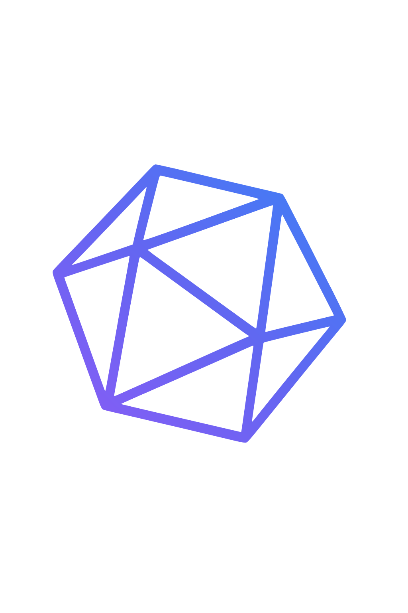

# Invoke

  

## Plateforme de Jeux de Rôle

*Une application moderne pour les passionnés de JDR*

  
    Appuyez sur Espace pour continuer <carbon:arrow-right class="inline"/>
  

---
layout: center
class: text-center
---

# 🎯 Vue d'ensemble

**Invoke** est une plateforme moderne dédiée aux passionnés de jeux de rôle (JDR).

  

    <h3 class="text-xl font-bold mb-4">🎮 Concept principal</h3>
    <ul class="text-sm space-y-2">
      <li>Plateforme communautaire pour les joueurs de JDR</li>
      <li>Gestion de sessions en ligne et hors ligne</li>
      <li>Système de campagnes pour les aventures long terme</li>
      <li>Interface moderne avec design responsive</li>
    </ul>
  

  

    <h3 class="text-xl font-bold mb-4">🏗️ Architecture</h3>
    <ul class="text-sm space-y-2">
      <li>Frontend : React + TypeScript + Vite</li>
      <li>Backend : Node.js + Express + MongoDB</li>
      <li>Authentification : JWT + Cookies sécurisés</li>
      <li>Upload d'images : Cloudinary (CDN mondial)</li>
    </ul>
  

---
layout: center
class: text-center
---

# 👥 Système d'Utilisateurs

  

    <h3 class="text-xl font-bold mb-4">USER</h3>
    
Joueur standard

    <ul class="text-xs mt-2 space-y-1">
      <li>Création de profil</li>
      <li>Jeux favoris</li>
      <li>Participation aux sessions</li>
      <li>Peut devenir MJ (isDM)</li>
    </ul>
  

  

    <h3 class="text-xl font-bold mb-4">ADMIN</h3>
    
Administrateur

    <ul class="text-xs mt-2 space-y-1">
      <li>Accès complet</li>
      <li>Gestion des jeux</li>
      <li>Support utilisateur</li>
      <li>Peut être MJ (isDM)</li>
    </ul>
  

  <h4 class="text-lg font-bold mb-2">🎭 Maître de Jeu (MJ)</h4>
  
Statut spécial accessible aux USER et ADMIN via le booléen <code>isDM</code>

  <ul class="text-xs mt-2 space-y-1">
    <li>Création de sessions</li>
    <li>Gestion de campagnes</li>
    <li>Jeux maîtrisés</li>
  </ul>

  
<strong>Sécurité :</strong> JWT avec cookies HTTP-only, validation des permissions, rate limiting

---
layout: center
class: text-center
---

# 🎲 Gestion des Jeux

  

    <h3 class="text-xl font-bold mb-4">📋 Modèle Game</h3>
    <ul class="text-sm space-y-2">
      <li><strong>Nom et description</strong> - Identification claire</li>
      <li><strong>Genre et système</strong> - Classification</li>
      <li><strong>Images</strong> - Logo, portrait, bannière</li>
      <li><strong>Statut</strong> - Mis en avant, actif</li>
      <li><strong>Relations</strong> - Lié aux sessions et campagnes</li>
    </ul>
  

  

    <h3 class="text-xl font-bold mb-4">🔍 Fonctionnalités</h3>
    <ul class="text-sm space-y-2">
      <li><strong>Catalogue</strong> - Liste des jeux disponibles</li>
      <li><strong>Recherche</strong> - Filtres par genre, système</li>
      <li><strong>Favoris</strong> - Système de jeux préférés</li>
      <li><strong>Maîtrise</strong> - Jeux que l'utilisateur peut maîtriser</li>
      <li><strong>Carousel</strong> - Jeux mis en avant sur l'accueil</li>
    </ul>
  

  
<strong>Stockage :</strong> Images stockées sur Cloudinary avec CDN mondial pour des performances optimales

---
layout: center
class: text-center
---

# 📅 Système de Sessions

  

    <h3 class="text-xl font-bold mb-4">🎮 Types de sessions</h3>
    <ul class="text-sm space-y-2">
      <li><strong>One-shot</strong> - Session unique</li>
      <li><strong>Campagne</strong> - Session faisant partie d'une campagne</li>
      <li><strong>En ligne</strong> - Session virtuelle</li>
      <li><strong>Hors ligne</strong> - Session physique</li>
    </ul>
  

  

    <h3 class="text-xl font-bold mb-4">⚙️ Gestion des sessions</h3>
    <ul class="text-sm space-y-2">
      <li><strong>Création</strong> - Par les MJ</li>
      <li><strong>Inscription</strong> - Par les joueurs (limite de places)</li>
      <li><strong>Statuts</strong> - Ouverte, complète, terminée, annulée</li>
      <li><strong>Informations</strong> - Date, heure, fuseau horaire, description</li>
    </ul>
  

  

    <h4 class="font-bold">Fonctionnalités avancées</h4>
    <ul class="text-xs mt-2 space-y-1">
      <li>Mise en avant des sessions recommandées</li>
      <li>Filtres par jeu, date, statut</li>
      <li>Export des données de session</li>
    </ul>
  

  

    <h4 class="font-bold">Workflow</h4>
    <ul class="text-xs mt-2 space-y-1">
      <li>MJ crée une session</li>
      <li>Joueurs s'inscrivent</li>
      <li>Session se déroule</li>
      <li>Évaluation et feedback</li>
    </ul>
  

<!--
Implémentation de feedback n'a pas encore été mise en place bien que le modèle et les controllers soient déjà existant, une priorité a été mise sur le développement de fonctionnalités clés.
-->

---
layout: center
class: text-center
---

# 📖 Système de Campagnes

  

    <h3 class="text-xl font-bold mb-4">🏗️ Gestion des campagnes</h3>
    <ul class="text-sm space-y-2">
      <li><strong>Création</strong> - Par les MJ</li>
      <li><strong>Participants</strong> - MJ + joueurs</li>
      <li><strong>Sessions</strong> - Liées à la campagne</li>
      <li><strong>Statut</strong> - Active, en pause, terminée</li>
    </ul>
  

  

    <h3 class="text-xl font-bold mb-4">📊 Fonctionnalités</h3>
    <ul class="text-sm space-y-2">
      <li><strong>Suivi</strong> - Progression de la campagne</li>
      <li><strong>Communication</strong> - Entre MJ et joueurs</li>
      <li><strong>Archivage</strong> - Conservation des données</li>
      <li><strong>Personnages</strong> - Gestion des personnages joueurs</li>
    </ul>
  

  <h4 class="text-lg font-bold mb-2">🎭 Système de Personnages (À venir)</h4>
  

    

      <ul class="space-y-1">
        <li>Propriétaire lié à un utilisateur</li>
        <li>Métadonnées dynamiques</li>
      </ul>
    

    

      <ul class="space-y-1">
        <li>Participation aux sessions</li>
        <li>Avatar personnalisé</li>
      </ul>
    

  

<!--
il en va de même pour les campagnes,
-->

---
layout: center
class: text-center
---

# 💬 Système de Communication

  

    <h3 class="text-xl font-bold mb-4">📞 Types de conversations</h3>
    <ul class="text-sm space-y-2">
      <li><strong>Contact admin</strong> - Support utilisateur</li>
      <li><strong>Chat utilisateur</strong> - Communication entre joueurs (à venir)</li>
      <li><strong>Sessions</strong> - Discussion pendant les parties (à venir)</li>
    </ul>
  

  

    <h3 class="text-xl font-bold mb-4">⚡ Fonctionnalités actuelles</h3>
    <ul class="text-sm space-y-2">
      <li><strong>Messages</strong> - Système de conversations avec admin</li>
      <li><strong>Statuts</strong> - Ouvert, en cours, fermé</li>
      <li><strong>Priorités</strong> - Faible, moyenne, élevée, urgente</li>
      <li><strong>Métadonnées</strong> - User-agent, IP, etc.</li>
    </ul>
  

  <h4 class="text-lg font-bold mb-2">🔮 Futures améliorations</h4>
  

    

      <h5 class="font-bold">Chat temps réel</h5>
      
Communication instantanée entre joueurs

    

    

      <h5 class="font-bold">Notifications</h5>
      
Système de notifications en temps réel

    

    

      <h5 class="font-bold">Discord/Email</h5>
      
Intégration pour les réponses

    

  

---
layout: center
class: text-center
---

# 🛡️ Panel d'Administration

  

    <h3 class="text-xl font-bold mb-4">🔐 Accès</h3>
    <ul class="text-sm space-y-2">
      <li><strong>Restriction</strong> - Uniquement aux administrateurs</li>
      <li><strong>Sécurité</strong> - Double vérification des permissions</li>
      <li><strong>Interface</strong> - Dashboard moderne et intuitif</li>
    </ul>
  

  

    <h3 class="text-xl font-bold mb-4">📊 Gestion</h3>
    <ul class="text-sm space-y-2">
      <li><strong>Utilisateurs</strong> - Liste, actions, statistiques</li>
      <li><strong>Jeux</strong> - CRUD, images, mise en avant</li>
      <li><strong>Sessions</strong> - Monitoring, actions, export</li>
      <li><strong>Campagnes</strong> - Suivi, participants, statuts</li>
    </ul>
  

  

    <h4 class="font-bold">Support utilisateur</h4>
    <ul class="text-xs mt-2 space-y-1">
      <li>Conversations de contact</li>
      <li>Système de tickets</li>
      <li>Gestion des priorités</li>
    </ul>
  

  

    <h4 class="font-bold">Statistiques</h4>
    <ul class="text-xs mt-2 space-y-1">
      <li>Nombre d'utilisateurs</li>
      <li>Sessions actives/terminées</li>
      <li>Taux d'engagement</li>
    </ul>
  

---
layout: center
class: text-center
---

# 🎨 Interface Utilisateur

  

    <h3 class="text-xl font-bold mb-4">🎨 Design</h3>
    <ul class="text-sm space-y-2">
      <li><strong>Thème</strong> - Sombre avec accents violets/bleus</li>
      <li><strong>Typographie</strong> - Cinzel pour les titres</li>
      <li><strong>Responsive</strong> - Mobile-first design</li>
      <li><strong>Animations</strong> - Transitions fluides</li>
    </ul>
  

  

    <h3 class="text-xl font-bold mb-4">📱 Pages principales</h3>
    <ul class="text-sm space-y-2">
      <li><strong>Accueil</strong> - Présentation, jeux mis en avant</li>
      <li><strong>Jeux</strong> - Catalogue et recherche</li>
      <li><strong>Sessions</strong> - Liste et création</li>
      <li><strong>Dashboard</strong> - Profil utilisateur</li>
      <li><strong>Admin</strong> - Panel d'administration</li>
    </ul>
  

  <h4 class="text-lg font-bold mb-2">🧩 Composants réutilisables</h4>
  

    

      <h5 class="font-bold">Cards</h5>
      
Affichage des jeux/sessions

    

    

      <h5 class="font-bold">Modals</h5>
      
Création/édition

    

    

      <h5 class="font-bold">Tables</h5>
      
Données tabulaires

    

    

      <h5 class="font-bold">Forms</h5>
      
Saisie de données

    

  

---
layout: center
class: text-center
---

# 🔧 Fonctionnalités Techniques

  

    <h3 class="text-xl font-bold mb-4">📤 Upload d'images</h3>
    <ul class="text-sm space-y-2">
      <li><strong>Service</strong> - Cloudinary (CDN mondial)</li>
      <li><strong>Types</strong> - Avatars, images de jeux, bannières</li>
      <li><strong>Optimisation</strong> - Compression automatique</li>
      <li><strong>Sécurité</strong> - URLs signées</li>
    </ul>
  

  

    <h3 class="text-xl font-bold mb-4">🔐 Authentification</h3>
    <ul class="text-sm space-y-2">
      <li><strong>JWT</strong> - Tokens sécurisés</li>
      <li><strong>Cookies</strong> - Stockage côté client</li>
      <li><strong>Middleware</strong> - Protection des routes</li>
      <li><strong>Sessions</strong> - Gestion des connexions</li>
    </ul>
  

  

    <h4 class="font-bold">API REST</h4>
    <ul class="text-xs mt-2 space-y-1">
      <li>Endpoints CRUD complet</li>
      <li>Validation Joi</li>
      <li>Rate Limiting</li>
      <li>CORS multi-origines</li>
    </ul>
  

  

    <h4 class="font-bold">Base de données</h4>
    <ul class="text-xs mt-2 space-y-1">
      <li>MongoDB NoSQL</li>
      <li>Mongoose ODM</li>
      <li>Références entre entités</li>
      <li>Indexation optimisée</li>
    </ul>
  

---
layout: center
class: text-center
---

# 🚀 Déploiement et Production

  

    <h3 class="text-xl font-bold mb-4">🌍 Environnements</h3>
    <ul class="text-sm space-y-2">
      <li><strong>Développement</strong> - Local avec hot-reload</li>
      <li><strong>Staging</strong> - Tests avant production</li>
      <li><strong>Production</strong> - Render (frontend + backend)</li>
    </ul>
  

  

    <h3 class="text-xl font-bold mb-4">⚙️ Variables d'environnement</h3>
    <ul class="text-sm space-y-2">
      <li><strong>Base de données</strong> - MONGODB_URI</li>
      <li><strong>Authentification</strong> - JWT_SECRET</li>
      <li><strong>Cloudinary</strong> - CLOUDINARY_* (3 variables)</li>
      <li><strong>CORS</strong> - FRONTEND_URLS</li>
    </ul>
  

  <h4 class="text-lg font-bold mb-2">📊 Monitoring</h4>
  

    

      <h5 class="font-bold">Logs</h5>
      
Winston avec rotation

    

    

      <h5 class="font-bold">Erreurs</h5>
      
Gestion centralisée

    

    

      <h5 class="font-bold">Performance</h5>
      
Optimisation des requêtes

    

  

---
layout: center
class: text-center
---

# 🎯 Points Forts de l'Application

  

    <h3 class="text-xl font-bold mb-4">✨ Fonctionnalités clés</h3>
    <ul class="text-sm space-y-2">
      <li><strong>Interface moderne</strong> - Design responsive et intuitif</li>
      <li><strong>Communauté active</strong> - Système de favoris et recommandations</li>
      <li><strong>Flexibilité</strong> - Support de différents types de JDR</li>
      <li><strong>Administration</strong> - Panel complet pour la gestion</li>
    </ul>
  

  

    <h3 class="text-xl font-bold mb-4">🔒 Qualités techniques</h3>
    <ul class="text-sm space-y-2">
      <li><strong>Sécurité</strong> - Authentification robuste et protection des données</li>
      <li><strong>Performance</strong> - CDN pour les images, optimisation des requêtes</li>
      <li><strong>Évolutivité</strong> - Architecture modulaire et extensible</li>
      <li><strong>Maintenabilité</strong> - Code structuré et documentation complète</li>
    </ul>
  

  <h4 class="text-lg font-bold mb-2">🚧 Améliorations Futures Possibles</h4>
  

    

      <h5 class="font-bold">Notifications</h5>
      
Système de notifications en temps réel

    

    

      <h5 class="font-bold">Calendrier</h5>
      
Intégration calendrier pour les sessions

    

    

      <h5 class="font-bold">Mobile</h5>
      
Application mobile native

    

  

---
layout: center
class: text-center
---

# 📊 Métriques et Statistiques

  

    <h3 class="text-xl font-bold mb-4">👥 Utilisateurs</h3>
    <ul class="text-sm space-y-2">
      <li>Inscriptions - Nouveaux comptes</li>
      <li>Activité - Sessions créées/jointe</li>
      <li>Engagement - Temps passé sur la plateforme</li>
    </ul>
  

  

    <h3 class="text-xl font-bold mb-4">🎮 Contenu</h3>
    <ul class="text-sm space-y-2">
      <li>Jeux - Nombre de jeux disponibles</li>
      <li>Sessions - Sessions créées/terminées</li>
      <li>Campagnes - Campagnes actives</li>
    </ul>
  

  

    <h3 class="text-xl font-bold mb-4">💬 Support</h3>
    <ul class="text-sm space-y-2">
      <li>Conversations - Messages de contact</li>
      <li>Résolution - Temps de réponse</li>
      <li>Satisfaction - Retours utilisateurs</li>
    </ul>
  

  
<strong>Monitoring :</strong> Système de logging complet avec Winston, rotation des fichiers, et métriques de performance

---
layout: center
class: text-center
---

# 🔒 Sécurité et Conformité

  

    <h3 class="text-xl font-bold mb-4">🛡️ Protection des données</h3>
    <ul class="text-sm space-y-2">
      <li><strong>Chiffrement</strong> - Mots de passe hashés (bcrypt)</li>
      <li><strong>HTTPS</strong> - Communication sécurisée</li>
      <li><strong>Validation</strong> - Sanitisation des entrées</li>
      <li><strong>CORS</strong> - Configuration restrictive</li>
    </ul>
  

  

    <h3 class="text-xl font-bold mb-4">📋 Gestion des erreurs</h3>
    <ul class="text-sm space-y-2">
      <li><strong>Logging</strong> - Traçabilité complète</li>
      <li><strong>Monitoring</strong> - Détection des anomalies</li>
      <li><strong>Récupération</strong> - Gestion des pannes</li>
      <li><strong>Rate Limiting</strong> - Protection contre les abus</li>
    </ul>
  

  <h4 class="text-lg font-bold mb-2">🔐 Authentification Sécurisée</h4>
  

    

      <h5 class="font-bold">JWT</h5>
      
Tokens avec expiration

    

    

      <h5 class="font-bold">Cookies</h5>
      
HTTP-only et sécurisés

    

    

      <h5 class="font-bold">Permissions</h5>
      
Gestion fine des rôles

    

  

---
layout: center
class: text-center
---

# 🎉 Merci !

  

  
    Merci pour votre attention !
  

